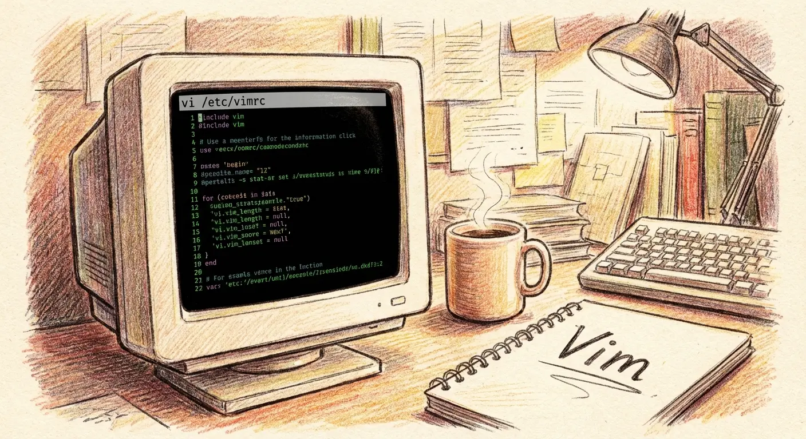

# Vim 操作動畫教學

62 支互動式 Vim 操作動畫，搭配 6 篇系列文章，從基礎移動到效率倍增，一步步掌握 Vim。



## 內容總覽

共 6 大主題、62 個互動式動畫示範：

| # | 主題 | 動畫數 | 文章連結 |
|---|------|--------|----------|
| 1 | 模式與移動 | 12 | [Vim 生存指南：模式與移動](https://blog.cashwu.com/blog/2026/vim-survival-guide) |
| 2 | 編輯基礎 | 15 | [Vim 編輯基礎：輸入、刪除和複製貼上](https://blog.cashwu.com/blog/2026/vim-editing-art) |
| 3 | Visual Mode | 8 | [Vim 選取模式：三種 Visual Mode](https://blog.cashwu.com/blog/2026/vim-visual-mode) |
| 4 | 語法系統 | 11 | [Vim 語法系統：動詞 + 量詞 + 名詞](https://blog.cashwu.com/blog/2026/vim-grammar-system) |
| 5 | 搜尋技巧 | 9 | [Vim 搜尋技巧：快速定位與取代](https://blog.cashwu.com/blog/2026/vim-search-skills) |
| 6 | 效率倍增 | 7 | [Vim 效率倍增：重複與自動化](https://blog.cashwu.com/blog/2026/vim-efficiency) |

## 在本機執行

直接用瀏覽器開啟 `index.html` 即可，或使用任何靜態檔案伺服器：

```bash
# Python
python3 -m http.server 8080

# Node.js
npx serve .
```

然後打開 `http://localhost:8080`。

## 技術棧

純 HTML / CSS / JavaScript，無任何框架或建置工具。

## 授權條款

本專案採用 [MIT License](LICENSE) 授權。

## 作者

[Cash Wu](https://github.com/cashwu)
